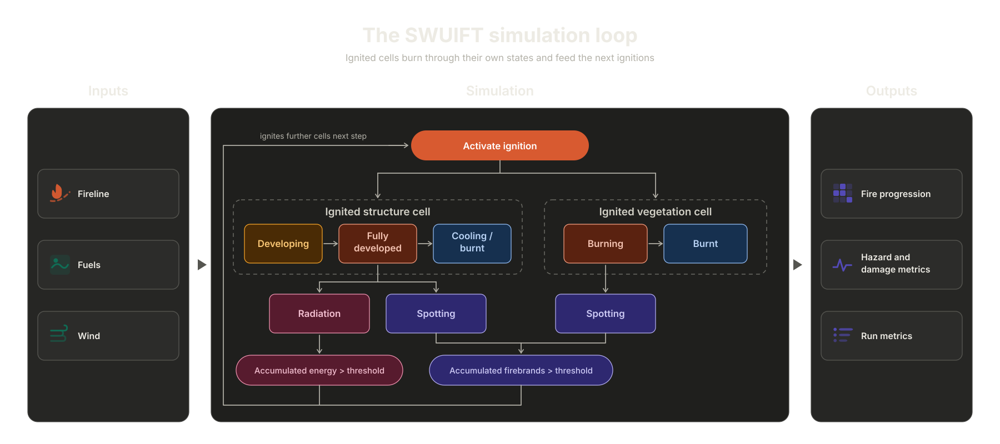

  

# SWUIFT

**Streamlined Wildland-Urban Interface Fire Tracing**

SWUIFT models fire spread within wildland-urban interface (WUI) and urban
communities using a semi-empirical approach. A three-domain solution is
utilized, defining wildland, transition and community domains following the
neighbourhood-based housing density (NBHD) method. Near- and far-field
transport mechanisms are captured, including thermal radiation and fire
spotting. SWUIFT considers urban and vegetative fuels and wind, and tracks fire
progression at a 10-meter resolution. Offline coupling with wildland fire
spread simulators is supported. Utilize the desktop application for an
interactive workflow or the command-line (CLI) for scripted and batch runs.

SWUIFT simulation results depend on input quality and modelling assumptions.
Analysis of results should rely on expert interpretation.

## How to cite

Software authors, ORCID links, and copyable BibTeX are generated from
`CITATION.cff` on every website build. See
[How to cite SWUIFT](https://swuift.github.io/citation-license/#how-to-cite-swuift).

## Related publication

Nima Masoudvaziri, Fernando Szasdi Bardales, Oguz Kaan Keskin, Amir
Sarreshtehdari, Kang Sun, and Negar Elhami-Khorasani. “Streamlined
wildland-urban interface fire tracing (SWUIFT): Modeling wildfire spread in
communities.” *Environmental Modelling & Software* 143 (2021): 105097. ISSN
1364-8152. [https://doi.org/10.1016/j.envsoft.2021.105097](https://doi.org/10.1016/j.envsoft.2021.105097).
[ScienceDirect](https://www.sciencedirect.com/science/article/pii/S1364815221001407).

## Choose a workflow

=== "Desktop"

    1. [Download](https://swuift.github.io/downloads/) the build for
       your platform.
    2. Follow [Install & verify](https://swuift.github.io/installation/).
    3. Select the nine required inputs and optional water mask, configure time
       and outputs, and add the run to the queue.
    4. Follow the [Desktop GUI guide](https://swuift.github.io/gui/).

=== "Command line"

    1. Install Python 3.10 or newer.
    2. Download the source archive or clone the repository, then follow
       [Install & verify](https://swuift.github.io/installation/).
    3. Run `swuift --help`.
    4. Follow the [CLI guide](https://swuift.github.io/cli/) or
       [Marshall tutorial](https://swuift.github.io/marshall-tutorial/).

## Model workflow

## Documentation map

- [Downloads](https://swuift.github.io/downloads/): release installers,
  Marshall archives, and digests.
- [Install & verify](https://swuift.github.io/installation/): SHA-256
  checks and desktop/CLI setup.
- [Input schema](https://swuift.github.io/input-schema/): required
  arrays, variables, shapes, and formats.
- [Expected outputs](https://swuift.github.io/outputs/): files created
  by desktop and CLI runs.
- [Citation, DOI, and license](https://swuift.github.io/citation-license/):
  reuse and attribution terms.
- [Troubleshooting and contact](https://swuift.github.io/troubleshooting/):
  common errors and support.
