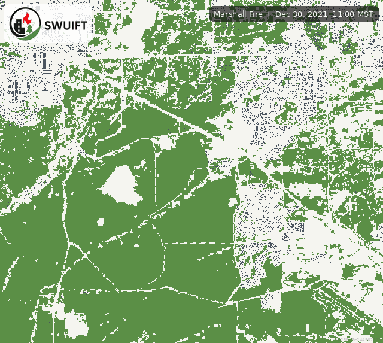

# Marshall tutorial

This walkthrough configures the requested Marshall window:

- **UTC convention:** `2021-12-30T18:00Z` through `2021-12-31T04:00Z`
- **Mountain Standard Time (UTC−07:00):** 11:00 through 21:00 on
  December 30, 2021
- **Timestep:** 5 minutes
- **Duration:** 10 hours = 600 minutes
- **Inclusive states:** `600 / 5 + 1 = 121`

!!! note "Timezone entry"
    Enter local wall times `2021-12-30 11:00` and `2021-12-30 21:00` with
    `America/Denver`. SWUIFT converts this interval to the validated UTC window
    internally and displays results in Mountain Standard Time. See
    [Timezone codes](timezones.md).

## Citation

Fernando Szasdi-Bardales, Kasra Shamsaei, Timothy W. Juliano, Branko Kosovic,
Hamed Ebrahimian, and Negar Elhami-Khorasani. “An offline coupling of fire
spread models to simulate the 2021 Marshall Fire.” *International Journal of
Wildland Fire* 34, no. 1 (2025): WF24027. ISSN 1049-8001.
[https://doi.org/10.1071/WF24027](https://doi.org/10.1071/WF24027).

See [Citation, DOI, and license](citation-license.md#marshall-example) for
BibTeX.

## 1. Download and prepare the input directory

Download the public Marshall **inputs** archive from
[Downloads](downloads.md) (release `v1.0.0`):

- [marshall_20211230_1100-2100_MST-inputs.tar.gz](https://github.com/SWUIFT/SWUIFT.github.io/releases/download/v1.0.0/marshall_20211230_1100-2100_MST-inputs.tar.gz)
- SHA-256: `REPLACE_AFTER_BUILD`

Optional reference **outputs** archive (validated Python run):

- [marshall_20211230_1100-2100_MST-output.tar.gz](https://github.com/SWUIFT/SWUIFT.github.io/releases/download/v1.0.0/marshall_20211230_1100-2100_MST-output.tar.gz)
- SHA-256: `REPLACE_AFTER_BUILD`

Extract the inputs archive:

```bash
mkdir -p "$HOME/swuift-data"
tar -xzf marshall_20211230_1100-2100_MST-inputs.tar.gz -C "$HOME/swuift-data"
export MARSHALL_INPUT_DIR="$HOME/swuift-data/marshall_20211230_1100-2100_MST"
```

The extracted directory contains the packaged scenario files
(`Marshall_inputs.mat`, `domains_mat.mat`, `standard.mat`, `veg_knowing.mat`,
`default_values.mat`, and a single HDF5 `wind.mat`). Tracked manifests and
per-file digests live in
[`examples/marshall_20211230_1100-2100_MST/`](https://github.com/SWUIFT/SWUIFT.github.io/tree/main/examples/marshall_20211230_1100-2100_MST).
Verify the archive digest above before use.

Recommended CLI entry point for this archive:

```bash
swuift --accept-license \
  --manifest examples/marshall_20211230_1100-2100_MST/manifest.json \
  --data-root "$MARSHALL_INPUT_DIR" \
  --output-dir "$HOME/swuift-results" \
  --lazy-wind
```

Sections 3–4 below show an equivalent explicit nine-path / desktop workflow for
users who map packaged files to the required logical roles in
[Input schema](input-schema.md).

## 2. Choose an external output directory

Create a writable location with enough space for frames and animations:

```bash
mkdir -p "$HOME/swuift-results"
```

The CLI rejects output inside its installed package tree.

## 3. Run with the CLI

Replace `<MARSHALL_INPUT_DIR>` and `<OUTPUT_DIR>` with absolute paths:

```bash
swuift \
  --job-name marshall_20211230_121_steps \
  --fire-prog <MARSHALL_INPUT_DIR>/wildland_fire_matrix.mat \
  --domains <MARSHALL_INPUT_DIR>/domain_matrix.mat \
  --landcover <MARSHALL_INPUT_DIR>/binary_cover_landcover.mat \
  --homes <MARSHALL_INPUT_DIR>/homes_matrix.mat \
  --lat <MARSHALL_INPUT_DIR>/latitude.mat \
  --lon <MARSHALL_INPUT_DIR>/longitude.mat \
  --harden-rad-map <MARSHALL_INPUT_DIR>/radiation_matrix.mat \
  --harden-spo-map <MARSHALL_INPUT_DIR>/spotting_matrix.mat \
  --wind <MARSHALL_INPUT_DIR>/wind.mat \
  --grid-size 10 \
  --t-start "2021-12-30 11:00" \
  --t-end "2021-12-30 21:00" \
  --timezone America/Denver \
  --harden-rad 70 \
  --harden-spo 70 \
  --rad-ig-thresh 14000 \
  --rad-decay 1.0 \
  --brand-wind-coef 30 \
  --brand-wind-sd 0.3 \
  --brand-wind-sd-lat 4.85 \
  --seed-harden 123456 \
  --seed-spread 10 \
  --lazy-wind \
  --output-dir <OUTPUT_DIR> \
  --frame-dpi 150 \
  --dump-every 0 \
  --no-dump-csv
```

The numeric settings above are an explicit tutorial configuration, not a
claim that they are universally appropriate. Cite and justify settings used
for research conclusions. The packaged Marshall scenario does not declare a
water variable, so SWUIFT uses the all-zero default mask.

## 4. Configure the desktop GUI

1. Select the same nine required files on **Data Inputs** and leave the
   optional water field blank.
2. On **Grid & Time**, choose `America/Denver`, set the start to
   `2021-12-30 11:00`, and set the end to `2021-12-30 21:00`.
3. Confirm the interface reports **121** inclusive states at five-minute
   spacing.
4. Enter the same radiation, firebrand, hardening, and seed values.
5. Select the output folder and enable **Lazy Wind** if memory is constrained.
6. Click **Add to Queue**, then **Run All**.

## 5. Confirm the run

Open the newly created `marshall_20211230_121_steps_<timestamp>/` directory.
Check `run_params.json` before interpreting results:

- `timezone` is `America/Denver`;
- local 11:00–21:00 corresponds to `2021-12-30T18:00:00Z` through
  `2021-12-31T04:00:00Z`;
- `max_steps` is `121`;
- the grid shape matches the Marshall bundle;
- input paths, seeds, and requested output switches are correct.

Then review `run_log.txt` for completion or warnings. Preserve those two files
with any reported figures or derived datasets.

## Marshall fire progression

{ width="100%" loading="eager" }
